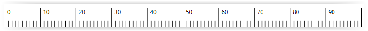
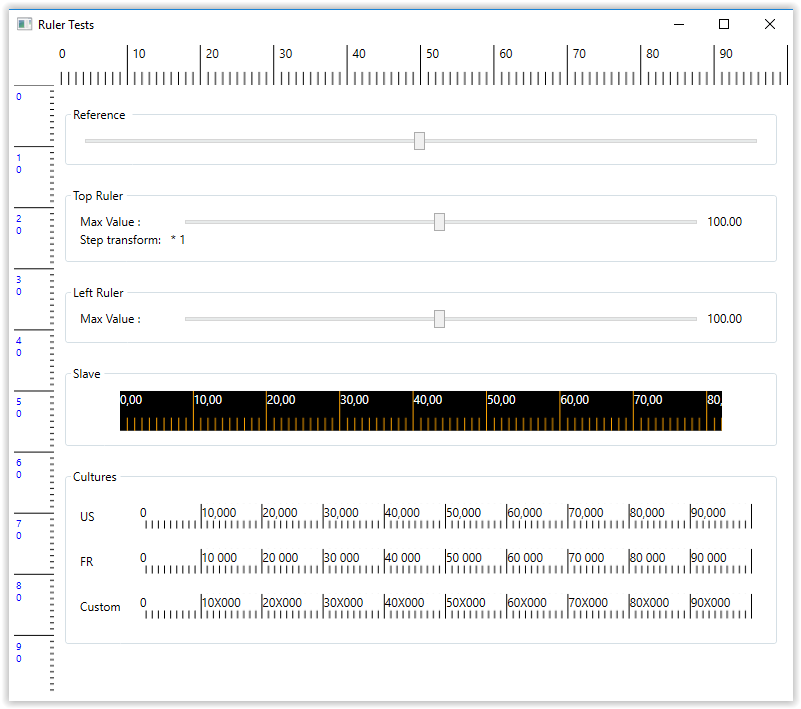

# Ruler.Wpf
[](https://opensource.org/licenses/MIT)
[![.NET Core][github-actions-badge]][github-actions]
[![Quality Gate Status][sonar-badge]][sonar-url]


In the WPF world, many controls exist, but it difficult to find a ruler. This project proposes a simple ruler usable in all Net Core 3.1 and Net Framework 4.7.2.



## Focused objectifs
- Performance
- Simplicity
- Customization
- Maintainability

## Features
Features available in control are:
- Definition of custom main step for scale
- Dynamic scale on resize
- Horizontal and vertical support (top and left position)
- Mark linked to mouse position
- Multi ruler synchronization
- Multi cultures
- Multiscale units
- Styling sample
- MVVM pattern

## Getting started

Add the resource dictionary inside application resources:

```xml
<ResourceDictionary>
  <ResourceDictionary.MergedDictionaries>
    <ResourceDictionary Source="pack://application:,,,/Ruler.Wpf;component/RulerStyle.xaml"/>
  </ResourceDictionary.MergedDictionaries>
</ResourceDictionary>
``` 

Use control as you need

```xml
<ruler:Ruler MarkerControlReference="{Binding ElementName=mainView}"
             MaxValue="400"
             MajorStepValues="{Binding MajorStep}"
             ValueStepTransform="{Binding ValueStepTransform}">
    <ruler:Ruler.Resources>
        <Style TargetType="TextBlock" BasedOn="{StaticResource {x:Type TextBlock}}">
            <Setter Property="Margin" Value="5 0"/>
        </Style>
    </ruler:Ruler.Resources>
</ruler:Ruler
``` 


### Testabilty
A WPF Net Core application shows how to use the ruler.



[github-actions]:                  https://github.com/xclemence/Ruler.Wpf/actions?query=workflow%3A".NET+Core"
[github-actions-badge]:            https://github.com/xclemence/Ruler.Wpf/workflows/.NET%20Core/badge.svg?branch=master

[sonar-badge]:                     https://sonarcloud.io/api/project_badges/measure?project=xclemence_Ruler.Wpf&metric=alert_status
[sonar-url]:                       https://sonarcloud.io/dashboard?id=xclemence_Ruler.Wpf
